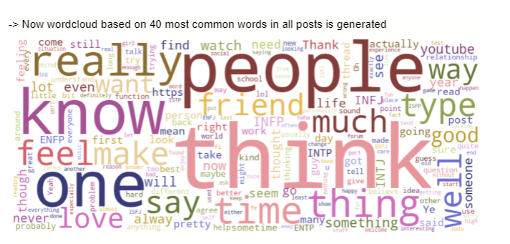
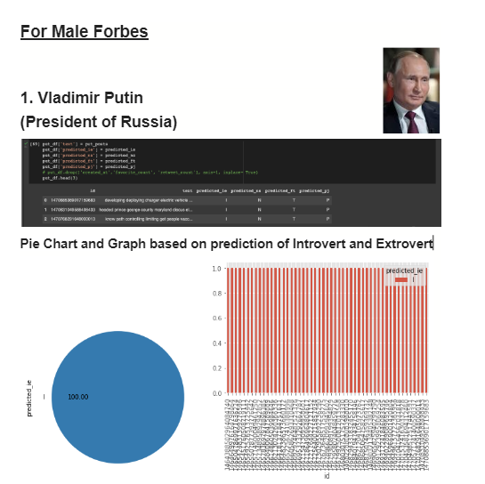
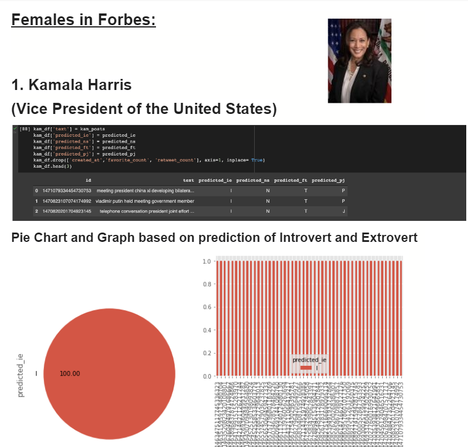

<!--
*** Thanks for checking out the Best-README-Template. If you have a suggestion
*** that would make this better, please fork the repo and create a pull request
*** or simply open an issue with the tag "enhancement".
*** Don't forget to give the project a star!
*** Thanks again! Now go create something AMAZING! :D
-->

<!-- PROJECT SHIELDS -->
<!--
*** I'm using markdown "reference style" links for readability.
*** Reference links are enclosed in brackets [ ] instead of parentheses ( ).
*** See the bottom of this document for the declaration of the reference variables
*** for contributors-url, forks-url, etc. This is an optional, concise syntax you may use.
*** https://www.markdownguide.org/basic-syntax/#reference-style-links
-->
<h1>MBTI Personality Prediction Using Tweet History</h1>

<!-- ABOUT THE PROJECT -->
### About The Project
The aim of our project is to sort different people into their MBTI personality types using our machine learning classifier. For this purpose, we would be using various text samples available from their social media posts and accounts. As there is a large amount of data and genuine information available in a social media account as opposed to a single personality test, we think that the accuracy of our model would be much higher than that of a single personality test therefore we decided to work in this area. A successful implementation of such a model would demonstrate a strong connection between personality type and the language that we use in our daily life. 

(<a href="#top">back to top</a>)

### Tech Stack

This section should list any major frameworks/libraries used to bootstrap your project. Leave any add-ons/plugins for the acknowledgements section. Here are a few examples.

* Python3
* Natural Language Processing
* Machine Learning

(<a href="#top">back to top</a>)

## Requirements 
   1. panda 
   2. matplotlib
   3. numpy
   4. nltk
   5. sklearn
   6. keras
   7. gensim
   8. tweepy

<!-- CONTRIBUTING -->
## Work Done

* Analysis and Preprocessing of the training data downloaded from Kaggle.

  

  

* Model trained on the following algorithms -  
   1. Catboost
   2. Linear SVC
   3. Multinomial NB
   4. XGBoost
   5. KNN
   6. Decision Tree
   7. SGD
   8. SVC  
  Linear SVC algorithm gave the best accuracy.
  

  

* Test Data Extraction from
   <ol>
      <li> Forbes Most Significant Figures</li>
      <li> The World’s Most Powerful Women and People</li>
    </ol>
  
Their MBTI Personality was gathered from Personality Database.Last 50 tweets were extracted.

* Test Data Visualization and Analysis
* 

  

  

Test data preprocessing.Predictions made on test data using Linear SVC.Variation observed in the following personality types using their last 50 tweets:
 
* <h3>Male Personalities</h3>
 

     
   

   
   <ol>
     <li> Vladimir Putin</li>
     <li> Pope Francis</li>
     <li>Rupert Murdoch</li>
     <li>Lloyd Blankfein</li>
     <li>Jeff Bezos</li>
   </ol>
   <h3>Female Personalities</h3>
   

     
   

   <ol>
     <li>Kamala Harris</li>
     <li>Jacinda Ardern</li>
     <li>Christine Lagarde</li>
     <li>Ursula von der Leyen</li>
     <li>Nancy Pelosi</li>
   </ol>

(<a href="#top">back to top</a>)

*Jeff Bezos' tweets were greatly varying in feeling and thinking whereas Jacinda Arden's tweets were greatly varying in perception and judging. *Vladimir Putin showed a consistent personality type in all his tweets whereas Kamala Harris’ mbti personality is not matching with personality type that she showed with her tweets.
*Also, we noticed that most of these significant figures showed a personality type INTP(Introversion Intuition Thinking Perception )through their tweets which is a little different than their original ones, which we believe could be a reason because of the formal language used in their tweets.

<!-- ACKNOWLEDGMENTS -->
## Acknowledgments

Use this space to list resources you find helpful and would like to give credit to. I've included a few of my favorites to kick things off!

* [Research Paper](https://web.stanford.edu/class/archive/cs/cs224n/cs224n.1184/reports/6839354.pdf)
* [Data Used for Training](https://www.kaggle.com/datasnaek/mbti-type)
* [The World’s Most Powerful People](https://www.forbes.com/powerful-people/list/#tab:overall)
* [The World’s Most Powerful Women](https://www.forbes.com/power-women/list/3/#tab:overall)
* [Personality Type Reference](https://www.personality-database.com/vote)

(<a href="#top">back to top</a>)

